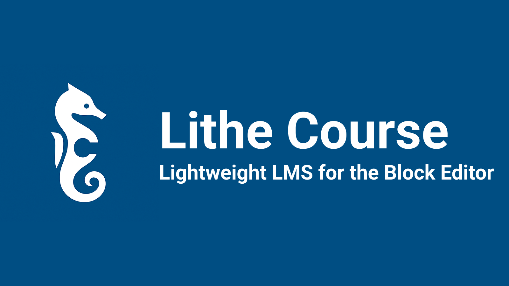

# Lithe Course

A lightweight, block-first Learning Management System (LMS) plugin for WordPress.  
Create, organize, and deliver courses with a clean, modern block-based experience.



---

## ✨ Features

- **Course Management** – Create courses with modules and lessons
- **Student Enrollment** – Manage enrollments and track progress
- **Gutenberg Blocks** – Block editor support for course content and videos
- **Drag & Drop Organizer** – Built with [@dnd-kit](https://github.com/clauderic/dnd-kit)
- **Progress Tracking** – Lesson completion and course progression
- **Block Theme Compatible** – Designed specifically for WordPress block themes

---

## 📦 Installation (End Users)

The stable plugin release is available from the [WordPress Plugin Directory](https://wordpress.org/plugins/lithe-course/).

To install manually:

1. Upload the plugin to `/wp-content/plugins/lithe-course`
2. Activate **Lithe Course** in **Plugins → Installed Plugins**
3. Start creating courses via the **Courses** menu in WP Admin

---

## 🛠 Development (Contributors)

This repository contains the full development source. To work with it locally:

```bash
# Clone the repo
git clone https://github.com/Tunglin-Li/lithecourse.git
cd lithecourse

# Install dependencies
npm install

# Build for production
npm run build

# Development with hot reload
npm run start
```

---

## 🧩 Built With

### JavaScript / Frontend

- [**@dnd-kit**](https://github.com/clauderic/dnd-kit) – Drag-and-drop course structure editor
- [**Framer Motion**](https://github.com/motiondivision/motion) – Smooth UI animations
- [**@wordpress/icons**](https://github.com/WordPress/gutenberg) – WordPress icon set
- [**@wordpress/scripts**](https://github.com/WordPress/gutenberg) – Build & bundling tools

### PHP / WordPress

- Custom Post Types (Courses, Lessons)
- Block registration APIs
- Enrollment + progress tracking logic

---

## 📂 Source Code Structure

```
├── blocks/          # Block source (React/JS)
├── build/           # Compiled block JS/CSS (for distribution)
├── inc/             # PHP backend classes
├── assets/          # Icons, banners, screenshots
├── readme.txt       # WordPress.org readme
└── README.md        # This file (GitHub readme)
```

---

## 🔒 Privacy & External Services

Lithe Course may embed videos from YouTube, Vimeo, or Bunny.net.
When learners play a video, the host may receive the video URL and standard web request data (IP address, cookies) according to their own privacy policies.

- **YouTube**: [Terms](https://www.youtube.com/t/terms) | [Privacy](https://policies.google.com/privacy)
- **Vimeo**: [Terms](https://vimeo.com/terms) | [Privacy](https://vimeo.com/privacy)
- **Bunny.net**: [Terms](https://bunny.net/tos/) | [Privacy](https://bunny.net/privacy/)

All course data, student enrollments, and progress tracking remain stored in your WordPress database.

---

## 📜 License

This project is licensed under the GPL-2.0-or-later License.  
See the [LICENSE](./LICENSE) file for details, or view the [GNU GPL v2.0 text](https://www.gnu.org/licenses/old-licenses/gpl-2.0.html).
